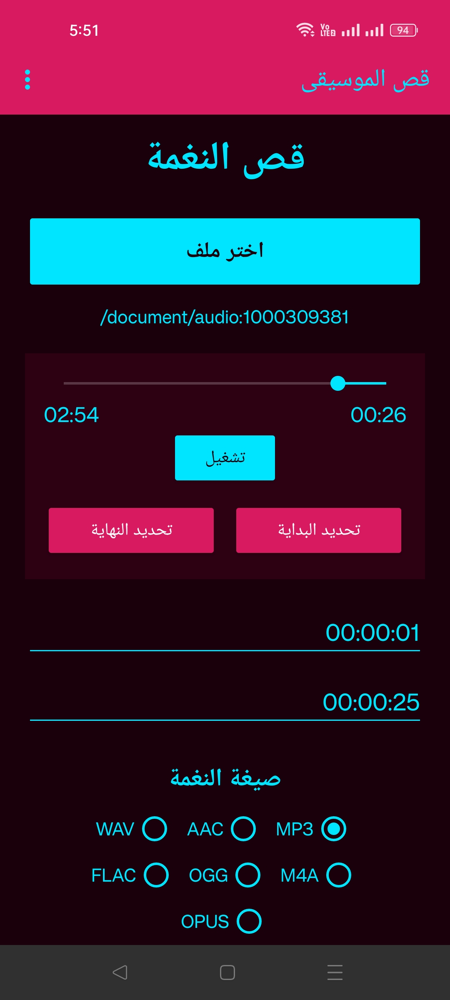
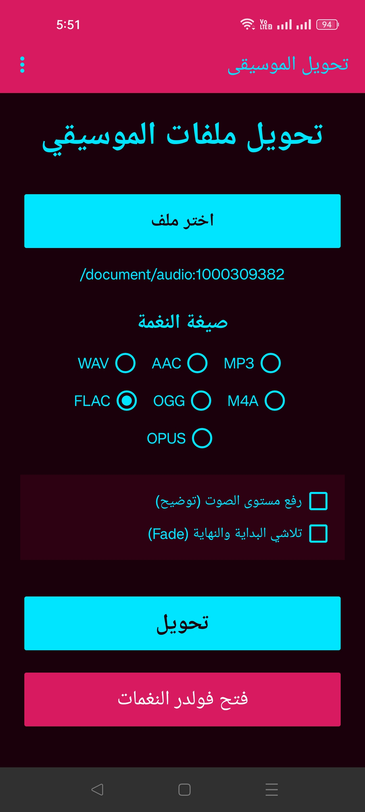

```markdown
# Rozix Ringtone

**Rozix Ringtone** هو تطبيق مجاني لنظام **Android** تم تطويره بواسطة **Rozix Systems**، ويتيح لك قص الملفات الصوتية وتحويلها إلى أشهر الصيغ الحديثة والشهيرة.

## المميزات

- 🎵 قص الملفات الصوتية بدقة.
- 🔄 تحويل الملفات بين أشهر الصيغ الصوتية.
- 📱 يعمل بالكامل دون اتصال بالإنترنت.
- ⚡ معالجة سريعة تعتمد على محرك **FFmpeg**.
- 🎧 يدعم أشهر الصيغ مثل:
  - MP3
  - AAC
  - M4A
  - WAV
  - FLAC
  - OGG
  - OPUS
- 📂 اختيار الملفات بسهولة من ذاكرة الهاتف.
- 🎨 واجهة بسيطة وسهلة الاستخدام.

## الاستخدامات

- إنشاء نغمات رنين مخصصة.
- تحويل الملفات الصوتية إلى صيغ مختلفة.
- قص المقاطع الصوتية الطويلة.
- تجهيز ملفات الصوت للمشاركة أو الحفظ.

## لقطات الشاشة






## التقنية المستخدمة

- Kotlin
- Android SDK
- FFmpeg

## المطور

**Rozix Systems**

### روابط Rozix

- GitHub: https://github.com/sherifmousa707-droid
- Facebook: https://www.facebook.com/RozixSystems

---

© 2026 Rozix Systems. جميع الحقوق محفوظة.
```
